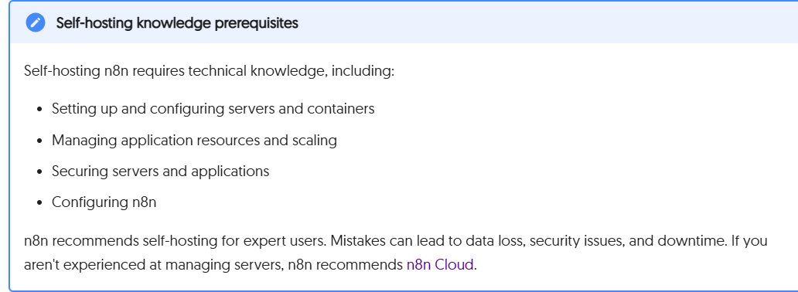

# Why This Exists

This didn’t start as a project.  
It started as confusion.

One day I kept seeing *n8n* everywhere — YouTube, LinkedIn, random posts.  
Everyone seemed to be using it. Everyone was excited about it.

So I got curious.

When I finally looked into it, I realized something strange:
the software itself is free…  
but actually *using it* isn’t.

There were three real ways people were running n8n:

- The official n8n Cloud — 14-day trial, then you pay  
- Cloud VMs and hosted instances — n8n baked-in, expensive and locked-in  
- Docker on localhost — good for devs, not for real use  

And suddenly it made sense why everyone was talking about n8n,  
but almost nobody really *owned* it.

The docs said *“self-hosted”*,  
but when I opened them, I hit a wall.

Self-hosting n8n comes with real technical prerequisites.

It requires you to be comfortable with:

- Setting up and configuring servers and containers  
- Managing application resources and scaling  
- Securing servers and applications  
- Installing, configuring, and maintaining n8n  

> Even n8n itself makes this clear.

They recommend self-hosting only for *expert users*, warning that mistakes can easily lead to:
- Data loss  
- Security vulnerabilities  
- Downtime  

If you aren’t experienced in managing servers, their official guidance is to use *n8n Cloud* instead.

That’s when it became obvious:

It wasn’t simple.  
It wasn’t welcoming.
It wasn’t built for people who just wanted to *use* n8n.

My brain quietly went:
> “This isn’t meant for people like me.”

So I stopped.

---

Weeks later, I'm in the college and the guy sitting next to me started talking about n8n.  
I asked him about it.

He told me:
> “Yeah, we use the 14-day trial and then keep switching accounts.”

That’s when it clicked.

This wasn’t just my problem.  
This was everyone’s problem.

People wanted n8n.  
They didn’t want:
- Cloud lock-in  
- Trial limits  
- Or DevOps pain  

So they were hacking around it instead of solving it.

That day, I couldn’t let it go.

I’ve always had three rules when something gets into my head:

1. Make it exist  
2. Make it better  
3. Release it when it’s a big deal  

So I started building.

Not “how to install n8n”.  
Not another Docker tutorial.

What I really wanted was:
> A way for normal people to actually own their n8n.

Something you could:
- Deploy on a VPS  
- Put behind a real domain  
- Have HTTPS  
- Have persistence  
- Have backups  
- And not be scared it will break tomorrow  

That’s what this repo became.

`n8n-compose` is not about containers.

It’s about making n8n:
- Yours  
- Portable  
- Reliable  
- And free in the way it was meant to be  

So that someone can do:

git clone -> bash setup -> bash start

…and suddenly they’re not on a trial anymore.
They’re not renting (n8n).
They own their automation.

That’s why this exists.
